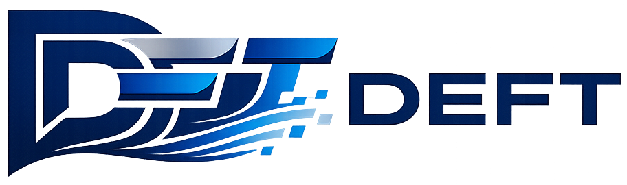

# ⚡ DEFT - Delta-Enabled File Transfer

[](https://www.rust-lang.org/)
[](LICENSE)
[](CHANGELOG.md)



**DEFT** is a modern, secure file transfer protocol designed for B2B (Business-to-Business) exchanges. It provides reliable, resumable transfers with enterprise-grade security and observability.

## ✨ Features

- 🔒 **Security** - mTLS + Ed25519 signatures + rate limiting
- 🚀 **Performance** - Parallel transfers + gzip compression + delta-sync
- 📊 **Observability** - Prometheus metrics + JSON logging + Web dashboard
- 🔄 **Reliability** - Automatic resume + multi-endpoint failover
- 🎯 **Automation** - Directory watching + plugin hooks
- 🌍 **Cross-platform** - Windows, Linux, macOS

## 📚 Documentation

| Document | Description |
|----------|-------------|
| [Quick Start](docs/QUICKSTART.md) | Get running in 5 minutes |
| [Getting Started](docs/GETTING_STARTED.md) | Complete setup guide |
| [Configuration](docs/CONFIGURATION.md) | All configuration options |
| [API Reference](docs/API.md) | REST API documentation |
| [Hooks & Plugins](docs/HOOKS.md) | Automation with scripts |
| [Protocol Spec](docs/PROTOCOL.md) | Wire protocol details |

## 🚀 Quick Start

```bash
# Build
cargo build --release

# Run daemon
./target/release/deftd --config config.example.toml

# Send a file
./target/release/deftd send partner-id invoices /path/to/file.xml

# Watch a directory
./target/release/deftd watch /data/outbound partner-id orders --pattern "*.xml"
```

## 📦 Installation

### From Source

```bash
git clone https://github.com/deft/deft.git
cd deft
cargo build --release

# Install binaries
sudo cp target/release/deftd /usr/local/bin/
```

### Configuration

```bash
# Copy example config
sudo mkdir -p /etc/deft
sudo cp config.example.toml /etc/deft/config.toml

# Generate certificates (see docs/GETTING_STARTED.md)
```

## 🏗️ Architecture

```
deft/
├── deft-protocol/     # Protocol definitions (commands, responses, parser)
├── deft-common/       # Shared utilities (chunking, hashing)
├── deft-daemon/       # Unified daemon (server + client + API)
│   ├── src/
│   │   ├── server.rs      # TLS server
│   │   ├── client.rs      # TLS client
│   │   ├── handler.rs     # Protocol handler
│   │   ├── api.rs         # REST API + Web dashboard
│   │   ├── metrics.rs     # Prometheus metrics
│   │   ├── hooks.rs       # Plugin system
│   │   ├── delta.rs       # Delta-sync algorithm
│   │   └── watcher.rs     # Directory watching
│   └── static/            # Web dashboard assets
└── docs/                  # Documentation
```

## 🔧 CLI Commands

```bash
# Start daemon (server mode)
deftd daemon

# Send a file to a partner
deftd send <partner-id> <virtual-file> <local-file>

# Receive a file from a partner
deftd get <partner-id> <virtual-file> <output-file>

# List available files from a partner
deftd list <partner-id>

# Watch directory and auto-send new files
deftd watch <directory> <partner-id> <virtual-file> [options]
    --pattern "*.xml"    # File pattern (glob)
    --interval 30        # Poll interval in seconds
    --delete-after       # Delete files after successful send
```

## 📊 Monitoring

### Prometheus Metrics

```bash
# Enable in config.toml
[limits]
metrics_enabled = true
metrics_port = 9090

# Scrape endpoint
curl http://localhost:9090/metrics
```

Available metrics:
- `deft_connections_total` / `deft_connections_active`
- `deft_transfers_total{direction,status}`
- `deft_bytes_transferred_total{direction}`
- `deft_transfer_duration_seconds{direction}`
- `deft_chunks_sent_total` / `deft_chunks_received_total`

### Web Dashboard

```bash
# Enable in config.toml
[limits]
api_enabled = true
api_listen = "127.0.0.1:7742"

# Access dashboard
open http://localhost:7742/
```

## 🔌 Plugin Hooks

Execute scripts on transfer events:

```toml
# In config.toml
[[hooks]]
event = "post_transfer"
command = "/scripts/notify.sh"
partners = ["acme-corp"]  # Optional filter
```

Available events: `pre_transfer`, `post_transfer`, `transfer_error`, `file_received`, `file_sent`

Environment variables: `DEFT_EVENT`, `DEFT_PARTNER_ID`, `DEFT_VIRTUAL_FILE`, `DEFT_FILE_SIZE`, `DEFT_CONTEXT_JSON`

## 🔒 Security

| Feature | Implementation |
|---------|----------------|
| Transport | TLS 1.3 (mTLS required) |
| Authentication | X.509 certificates |
| Integrity | SHA-256 per chunk |
| Signatures | Ed25519 for receipts |
| Rate Limiting | Per IP, partner, bandwidth |
| Anti-replay | Nonces per chunk |

## 📄 License

MIT License - see [LICENSE](LICENSE) for details.

## 🤝 Contributing

1. Fork the repository
2. Create a feature branch (`git checkout -b feature/amazing`)
3. Commit changes (`git commit -m 'Add amazing feature'`)
4. Push to branch (`git push origin feature/amazing`)
5. Open a Pull Request

## 📞 Support

- 📖 [Documentation](docs/)
- 🐛 [Issue Tracker](https://github.com/deft/deft/issues)
- 💬 [Discussions](https://github.com/deft/deft/discussions)
